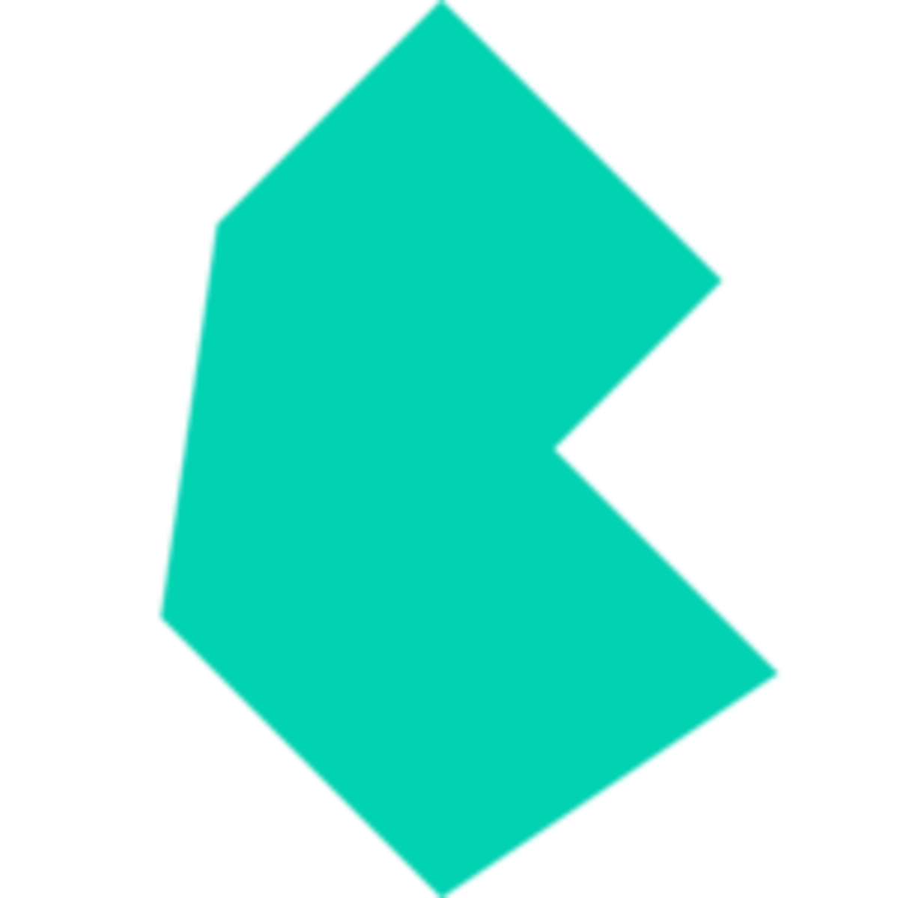

<p align="center">
    <a href="https://github.com/yiisoft" target="_blank">
        
    </a>
    <a href="https://bulma.io/" target="_blank" rel="external">
        
    </a>
    <h1 align="center">Yii Framework Bulma Integration</h1>
    <br>
</p>

[](https://packagist.org/packages/yiisoft/yii-bulma)
[](https://github.com/yiisoft/yii-bulma/actions?query=workflow%3Abuild)
[](https://scrutinizer-ci.com/g/yiisoft/yii-bulma/?branch=master)
[](https://scrutinizer-ci.com/g/yiisoft/yii-bulma/?branch=master)
[](https://dashboard.stryker-mutator.io/reports/github.com/yiisoft/yii-bulma/master)
[](https://github.com/yiisoft/yii-bulma/actions?query=workflow%3A%22static+analysis%22)
[](https://shepherd.dev/github/yiisoft/yii-bulma)

This Yii Framework package encapsulates Bulma components and plugins in terms of Yii widgets, and thus makes using Bulma components/plugins in Yii applications convenient.

## Installation

```shell
composer require yiisoft/yii-bulma
```
## Using assets

Bulma is a CSS framework that provides all the CSS and SASS files to customize your application, the widgets by default do not register any Asset so you must register them in your application to be used, since you can simply use the Default CSS file layout, or build your own custom CCS.

Three Assets are provided:

- [BulmaAsset:](https://bulma.io/) CSS, SASS file bulma css framework without JS code.
- [BulmaHelperAsset:](https://github.com/jmaczan/bulma-helpers) CSS, SASS, MIXINS it is an auxiliary library provide file helpers for Bulma CSS framework.
- [BulmaJsAsset:](https://github.com/jgthms/bulma) Vizuaalog/BulmaJs it is an auxiliary library that has all the JS used by the Bulma CSS framework, you can decide to use this library, or alternatively write your own JS code.

To use widgets only, register `BulmaAsset::class`, which we can do in several ways explained below.

### Register asset in view layout or individual view

By registering the Asset in the `resources/layout/main.php` it will be available for all views. If you need it registered for individual view (such as `resources/views/site/contact.php`) only, register it in that view.


```php
use  Yiisoft\Yii\Bulma\Asset\BulmaAsset;

/**
 * @var Yiisoft\Assets\AssetManager $assetManager
 * @var Yiisoft\View\WebView $this
 */

$assetManager->register([
    BulmaAsset::class,
]);

$this->setCssFiles($assetManager->getCssFiles());
$this->setJsFiles($assetManager->getJsFiles());
```

### Register asset in application params

You can register asset in the application parameters, `config/params.php`. Asset will be available for all views of this application.

```php
use Yiisoft\Yii\Bulma\Asset\BulmaAsset;

'yiisoft/asset' => [
    'assetManager' => [
        'register' => [
            BulmaAsset::class
        ],
    ],
],
```

Then in `main.php`:

```php
/* @var Yiisoft\View\WebView $this */

$this->setCssFiles($assetManager->getCssFiles());
$this->setJsFiles($assetManager->getJsFiles());
```

## Widgets usage

We will quickly and easily describe how to use widgets, and be able to use all the power of the Bulma CSS framework with php.

- [Breadcrumbs](docs/breadcrumbs.md)
- [Dropdown](docs/dropdown.md)
- [NavBar](docs/navbar.md)
- [Menu](docs/menu.md)
- [Message](docs/message.md)
- [ProgressBar](docs/progressbar.md)
- [Modal](docs/modal.md)
- [ModalCard](docs/modalcard.md)
- [Tabs](docs/tabs.md)
- [Panel](docs/panel.md)

### Unit testing

The package is tested with [PHPUnit](https://phpunit.de/). To run tests:

```shell
./vendor/bin/phpunit
```

### Mutation testing

The package tests are checked with [Infection](https://infection.github.io/) mutation framework. To run it:

```shell
./vendor/bin/infection
```

### Static analysis

The code is statically analyzed with [Psalm](https://psalm.dev/). To run static analysis:

```shell
./vendor/bin/psalm
```

### Support the project

[](https://opencollective.com/yiisoft)

### Follow updates

[](https://www.yiiframework.com/)
[](https://twitter.com/yiiframework)
[](https://t.me/yii3en)
[](https://www.facebook.com/groups/yiitalk)
[](https://yiiframework.com/go/slack)

## License

The Yii Framework Bulma Integration is free software. It is released under the terms of the BSD License.
Please see [`LICENSE`](./LICENSE.md) for more information.

Maintained by [Yii Software](https://www.yiiframework.com/).
