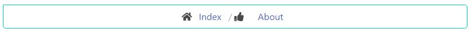

## Breadcrumbs widget

The Bulma breadcrumb is a simple navigation component that only requires a breadcrumb `container` and `ul` list. The dividers are automatically created in the content of the ::before pseudo-element of li tags.

You can inform the current page using the is-active modifier in a li tag. It will disable the navigation of inner links.

<p align="center">
    
</p>

### Usage

```php
<?php

declare(strict_types=1);

/** 
 * The Font-Awesome Asset must be added, in this case we are going to use an external library.
 * {@see https://github.com/yii-extension/fontawesome}
 */
use Yii\Extension\Fontawesome\Dev\Css\NpmAllAsset;
use Yiisoft\Yii\Bulma\Breadcrumbs;
use Yiisoft\Yii\Bulma\Asset\BulmaAsset;

/* Register assets in view */

$assetManager->register([
    BulmaAsset::class,
    NpmAllAsset::class,
]);

$this->setCssFiles($assetManager->getCssFiles());
$this->setJsFiles($assetManager->getJsFiles());
?>

<?= Breadcrumbs::widget()
    ->homeLink([
        'label' => 'Index',
        'url' => '/index',
        'icon' => 'fas fa-home',
        'iconOptions' => ['class' => 'icon']
    ])
    ->links([
        [
            'label' => 'About',
            'url' => '/about',
            'icon' => 'fas fa-thumbs-up',
            'iconOptions' => ['class' => 'icon']
        ]
    ])
    ->options(['class' => 'is-centered'])
    ->render() ?>
```

The code above generates the following HTML:

```html
<nav id="w1-breadcrumbs" class="breadcrumb is-centered" aria-label="breadcrumbs">
    <ul>
        <li><span class="icon"><i class="fas fa-home"></i></span><a href="/index">Index</a></li>
        <li><span class="icon"><i class="fas fa-thumbs-up"></i></span><a href="/about">About</a></li>
    </ul>
</nav>
```

Method                             | Description
-----------------------------------|------------
`id(string $value)`                | Widget ID.
`encodeLabels(bool $value)`        | Whether to HTML-encode the link labels.
`homeLink(array $value)`           | The first hyperlink in the breadcrumbs (called home link).
`itemTemplate(string $value)`      | The template used to render each inactive item in the breadcrumbs.
`itemTemplateActive(string $value)`| The template used to render each active item in the breadcrumbs.
`links(array $value)`              | List of links to appear in the breadcrumbs.
`options(array $value)`            | The HTML attributes for the widget container nav tag.
`optionsItems(array $value)`       | The HTML attributes for the items widget. 
