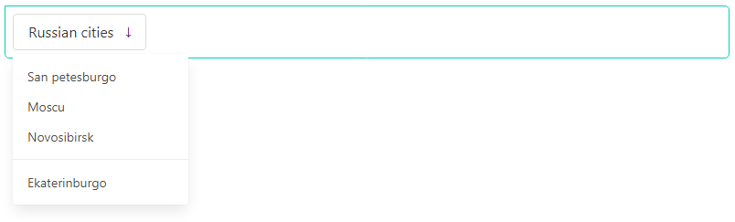

## Dropdown widget

The dropdown component is a container for a dropdown button and a dropdown menu.

<p align="center">
    
</p>

HTML generated consists of:

- `dropdown` the main container.
- `dropdown-trigger` the container for a button.
- `dropdown-menu` the toggable menu, hidden by default.
- `dropdown-content` the dropdown box, with a white background and a shadow.
- `dropdown-item` each single item of the dropdown, which can either be a a or a div.
- `dropdown-divider` a horizontal line to separate dropdown items.

## Usage

```php
/**
 * @var Yiisoft\Assets\AssetManager $assetManager
 * @var Yiisoft\View\WebView $this
 */

/* Register assets in view */

$assetManager->register([
    BulmaAsset::class,
    BulmaJsAsset::class
]);

$this->setCssFiles($assetManager->getCssFiles());
$this->setJsFiles($assetManager->getJsFiles());
?>

<?= Dropdown::widget()
    ->buttonLabel('Russian cities')
    ->items([
        ['label' => 'San petesburgo', 'url' => '#'],
        ['label' => 'Moscu', 'url' => '#'],
        ['label' => 'Novosibirsk', 'url' => '#'],
        '-',
        ['label' => 'Ekaterinburgo', 'url' => '#'],
    ])
    ->render();
?>
```

HTML produced is like the following:

```html
<div id="w1-dropdown" class="dropdown">
    <div class="dropdown-trigger">
        <button class="button" aria-haspopup="true" aria-controls="dropdown-menu">
            <span>Russian cities</span>
            <span class="icon is-small">
                <i class="fas fa-angle-down" aria-hidden="true"></i>
            </span>
        </button>
    </div>
    <div class="dropdown-menu">
        <a class="dropdown-item" href="#">San petesburgo</a>
        <a class="dropdown-item" href="#">Moscu</a>
        <a class="dropdown-item" href="#">Novosibirsk</a>
        <div class="dropdown-divider"></div>
        <a class="dropdown-item" href="#">Ekaterinburgo</a>
    </div>
</div>
```

Method                            | Description |
----------------------------------|-------------|
`id(string $value)`               | Widget ID.
`buttonLabelOptions(array $value)`| The HTML attributes for the button dropdown.
`cssDivider(string $value)`       | Set css class divider dropdown.
`cssItem(string $value)`          | Set css class item dropdown.
`cssItems(string $value)`         | Set css class items container dropdown.
`encodeLabels(bool $value)`       | Whether the labels for header items should be HTML-encoded.
`enclosedByContainer(bool $value)`| Set enclosed by container dropdown.
`items(array $value)`             | List of menu items in the dropdown.
`options(array $value)`           | The HTML attributes for the widget container tag.
`optionsItems(array $value)`      | The HTML attributes for the widget items.
`optionsTrigger(array $value)`    | The HTML attributes for the widget container trigger.
