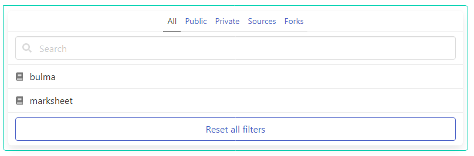

# Panel widget

### A composable [panel](https://bulma.io/documentation/components/panel/), for compact controls

<p align="center">
    </br>
    
</p>

## Usage

```php
<?php
use Yiisoft\Yii\Bulma\Panel;
use Yiisoft\Yii\Bulma\Asset\BulmaAsset;
use Yiisoft\Yii\Bulma\Asset\BulmaJsAsset;

/**
 * @var \Yiisoft\Assets\AssetManager $assetManager
 * @var \Yiisoft\View\WebView $this
 */

$assetManager->registerMany([
    BulmaAsset::class,
    BulmaJsAsset::class,
]);

$this->setCssFiles($assetManager->getCssFiles());
$this->setJsFiles($assetManager->getJsFiles());

$template = <<<HTML
    {panelBegin}{panelHeading}{panelTabs}
    <div class="panel-block">
    <p class="control has-icons-left">
    <input class="input" type="text" placeholder="Search" />
    <span class="icon is-left">
    <i class="fas fa-search" aria-hidden="true"></i>
    </span>
    </p>
    </div>
    {panelItems}
    <div class="panel-block">
    <button class="button is-link is-outlined is-fullwidth">
    Reset all filters
    </button>
    </div>
    {panelEnd}
HTML;

echo Panel::widget()
    ->template($template)
    ->tabs([
        [
            'label' => 'All',
            'active' => true,
            'urlAttributes' => ['data-all' => true],
            'items' => [
                [
                    'label' => 'bulma',
                    'icon' => 'fas fa-book',
                    'urlAttributes' => ['data-category' => 'All'],
                ],
                [
                    'label' => 'marksheet',
                    'icon' => 'fas fa-book',
                    'urlAttributes' => ['data-category' => 'All'],
                ],
            ],
        ],
        ['label' => 'Public', 'urlAttributes' => ['data-target' => 'Public']],
        ['label' => 'Private', 'urlAttributes' => ['data-target' => 'Private']],
        ['label' => 'Sources', 'urlAttributes' => ['data-target' => 'Sources']],
        ['label' => 'Forks', 'urlAttributes' => ['data-target' => 'Fork']],
    ])
    ->render()
```

HTML produced is like the following:

```html
<nav id="w1-panel" class="panel">
    <p class="panel-tabs">
        <a class="is-active" href="#w1-panel" data-all>All</a>
        <a data-target="Public">Public</a>
        <a data-target="Private">Private</a>
        <a data-target="Sources">Sources</a>
        <a data-target="Fork">Forks</a>
    </p>
    <div class="panel-block">
        <p class="control has-icons-left">
            <input class="input" type="text" placeholder="Search" />
            <span class="icon is-left">
                <i class="fas fa-search" aria-hidden="true"></i>
            </span>
        </p>
    </div>
    <a class="panel-block" data-category="All">
        <span class="panel-icon">
            <i class="fas fa-book" aria-hidden="true"></i>
        </span>
        bulma
    </a>
    <a class="panel-block" data-category="All">
        <span class="panel-icon">
            <i class="fas fa-book" aria-hidden="true"></i>
        </span>
        marksheet
    </a>
    <div class="panel-block">
        <button class="button is-link is-outlined is-fullwidth">
            Reset all filters
        </button>
    </div>
</nav>
```

## Reference

Method | Description | Default
-------|-------------|---------
`attributes(array $value)` | HTML attributes for the widget container nav tag. | `[]`
`autoIdPrefix(string $value)` | Prefix to the automatically generated widget ID. | `w`
`blockClass(string $value)` | CSS class for the panel block. | `panel-block`
`color(string $value)` | Color panel Options available are: (`Panel::COLOR_DARK`, `Panel::COLOR_PRIMARY`, `Panel::COLOR_LINK`, `Panel::COLOR_INFO`, `Panel::COLOR_SUCCESS`, `Panel::COLOR_WARNING`, `Panel::COLOR_DANGER`) | `''`
`cssClass(string $value)` | CSS class for the widget container nav tag. | `''`
`heading(string $value)` | Text of the brand heading. | `''`
`headingAttributes(array $value)` | HTML attributes of the heading. | [`class` => `panel-heading`]
`iconClass(string $value)` | CSS class for the panel icon. | `panel-icon`
`id(string $value)` | Widget ID. | `''`
`isActiveClass(string $value)` | CSS class for the active tab. | `is-active`
`tabClass(string $value)` | CSS class for the panel tab. | `panel-tab`
`tabs(array $value)` | List of panel tabs items. | `[]`
`tabsAttributes(array $value)` | HTML attributes for the tabs container tag. | `[]`
`template(string $value)` | String the template for rendering panel. | `{panelBegin}{panelHeading}{panelTabs}{panelItems}{panelEnd}`

### Tabs structure is an array of the following structure

```php
[
    [
        'label' => '',
        'url' => '',
        'active' => false,
        'urlAttributes' => [],
        'encode' => false,
        'items' => [
            [
                'label' => '',
                'icon' => '',
                'url' => '',
                'urlAttributes' => [],
                'encode' => false,
            ],
        ],
    ],
]
