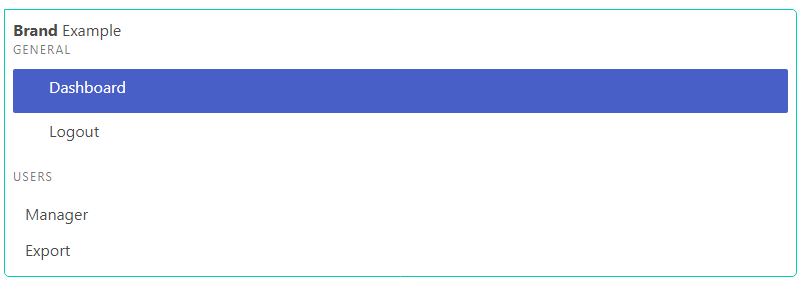

# Menu widget

[The Bulma menu](https://bulma.io/documentation/components/menu/) is a vertical navigation component.

<p align="center">
    
</p>

HTML generated consists of:
- The `menu` container.
- Informative `menu-label` labels.
- Interactive `menu-list` lists that can be nested up to 2 levels.

## Usage

```php
/**
 * @var Yiisoft\Assets\AssetManager $assetManager
 * @var Yiisoft\View\WebView $this
 */

use Yiisoft\Yii\Bulma\Asset\BulmaAsset;
use Yiisoft\Yii\Bulma\Menu;

/* Register assets in view */

$assetManager->register([
    BulmaAsset::class
]);

$this->setCssFiles($assetManager->getCssFiles());
$this->setJsFiles($assetManager->getJsFiles());
?>

<?= Menu::widget()
    ->withBrand(
        '<div class=aside-tools>' . "\n" . '<div class=aside-tools-label>' . "\n" .
        '<span><b>Brand</b> Example</span>' . "\n" . '</div>' . "\n" . '</div>'
    )
    ->withCurrentPath('site/index')
    ->withItems([
        ['label' => 'General',
            'items' => [
                [
                    'label' => 'Dashboard',
                    'url' => 'site/index',
                    'icon' => 'mdi mdi-desktop-mac',
                    'iconOptions' => ['class' => 'icon']
                ],
                [
                    'label' => 'Logout',
                    'url' => 'site/logout',
                    'icon' => 'mdi mdi-logout',
                    'iconOptions' => ['class' => 'icon']
                ],
            ]
        ],
        ['label' => 'Users',
            'items' => [
                ['label' => 'Manager', 'url' => 'user/index'],
                ['label' => 'Export', 'url' => 'user/export']
            ]
        ],
    ])
    ->render() ?>
```

HTML produced is like the following:

```html
<aside class="menu">
    <div class=aside-tools>
        <div class=aside-tools-label>
            <span><b>Brand</b> Example</span>
        </div>
    </div>
    <ul class="menu-list">
        <p class="menu-label">General</p>
        <ul class = menu-list>
            <li>
                <a href="site/index" class="is-active">
                    <span class="icon"><i class="mdi mdi-desktop-mac"></i></span>Dashboard
                </a>
            </li>
            <li>
                <a href="site/logout">
                    <span class="icon"><i class="mdi mdi-logout"></i></span>Logout
                </a>
            </li>
        </ul>
        <p class="menu-label">Users</p>
        <ul class = menu-list>
            <li><a href="user/index">Manager</a></li>
            <li><a href="user/export">Export</a></li>
        </ul>
    </ul>
</aside>
```

Method | Description | Default
-------|-------------|---------
`withId(string $value)` | Widget ID. | `''`
`withoutActivateItems()` | Disable activate items according to whether their currentPath. | `false`
`withActivateParents()` | Whether to activate parent menu items when one of the corresponding child menu items is active. | `true`
`withActiveCssClass(string $value)` | The CSS class to be appended to the active menu item. | `is-active`
`withBrand(string $value)` | Custom brand content. | `''`
`withCurrentPath(string $value)` | Allows you to assign the current path of the URL from request controller. | `''`
`withouEncodeLabels()` | When tags Labels HTML should not be encoded. | `false`
`withFirstItemCssClass(string $value)` | The CSS class for the first item in the main menu or each submenu. | `''`
`withoutHideEmptyItems()` | Whether to hide empty menu items. An empty menu item is one whose `url` option is not set and which has no visible child menu items. | `false`
`withItems(array $value)` | List of menu items. | `[]`
`withItemOptions(array $value)` | List of HTML attributes shared by all menu. | `[]`
`withLabelTemplate(string $value)`| The template used to render the body of a menu which is NOT a link. | `''`
`withLastItemCssClass(string $value)` | The CSS class that will be assigned to the last item in the main menu or each submenu. | `''`
`withLinkTemplate(string $value)` | The template used to render the body of a menu which is a link. | `<a href={url}>{icon}{label}</a>`
`withOptions(array $value)` | The HTML attributes for the menu's container tag. | `[]`
`withSubMenuTemplate(string $value)` | The template used to render a list of sub-menus. | `<ul class = menu-list>\n{items}\n</ul>`
`withEncodeTags()` | Allows you to enable the encoding tags html. | `true`
