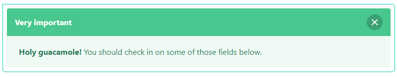

## Message widget

The message widget renders HTML necessary to display a message like the following:

<p align="center">
    
</p>

HTML generated consists of:

- A `message` container.
- An optional `message-header` that can hold a title, and a "delete" element.
- A `message-body` for the longer body of the message.

In order for the message to be close-able you can use the asset `BulmaJsAsset::class`, which registers
necessary JavaScript. Alternatively, you can use your own JavaScript code.

### Usage

```php
<?php

declare(strict_types=1);

use Yiisoft\Yii\Bulma\Message;
use Yiisoft\Yii\Bulma\Asset\BulmaAsset;
use Yiisoft\Yii\Bulma\Asset\BulmaJsAsset;

/* Register assets in view */

$assetManager->register([
    BulmaAsset::class,
    BulmaJsAsset::class,
]);

$this->setCssFiles($assetManager->getCssFiles());
$this->setJsFiles($assetManager->getJsFiles());
?>

<?= Message::widget()
    ->headerColor('is-success')
    ->headerMessage('Very important')
    ->body('<strong>Holy guacamole!</strong> You should check in on some of those fields below.')
    ->size('is-large')
    ->options(['class' => 'has-text-justified']) ?>
```

The code above generates the following HTML:

```html
<div id="w1-message" class="message is-success">
    <div class="message-header">
        <p>Very important</p>
        <button type="button" class="delete"><span aria-hidden="true">&times;</span></button>
    </div>
    <div class="message-body">
        <strong>Holy guacamole!</strong> You should check in on some of those fields below.
    </div>
</div>
```

Method                            | Description
----------------------------------|------------
`id(string $value)`               | Set id widget.
`body(string $value)`             | Lets you define the content in the body message.
`headerColor(string $value)`      | Set color header message ('is-dark', 'is-primary', 'is-link', 'is-info', 'is-success', 'is-warning', 'is-danger') 
`headerMessage(string $value)`    | Lets you define the content in the header message.
`options(array $value)`           | The HTML attributes for the widget container tag.
`optionsBody(array $value)`       | The HTML attributes for the widget body tag.
`optionsCloseButton(array $value)`| The options for rendering the close button tag.
`optionsHeader(array $value)`     | The HTML attributes for the widget header tag.
`size(string $value)`             | Set size message widget, default setting empty normal, 'is-small', 'is-medium', 'is-large'.
`withoutCloseButton(bool $value)` | Allows you to disable close button message widget.
`withoutHeader(bool $value)`      | Allows you to disable header widget.
