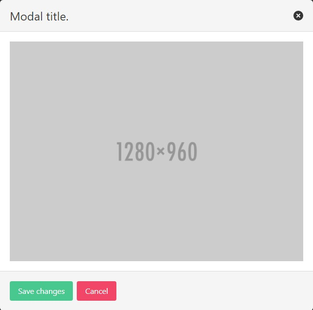

# Modal card widget

### A classic [modal](https://bulma.io/documentation/components/modal/) overlay, in which you can include any content you want

<p align="center">
    </br>
    
</p>

The modal structure:
- `modal`: the main container
    - `modal-background`: a transparent overlay that can act as a click target to close the modal
    - `modal-card`: ...
        - `modal-card-head`: ...
            - `modal-card-title`: ...
    - `modal-card-body`: ...
    - `modal-card-foot`: ...

## Usage

```php
<?php

declare(strict_types=1);

use Yiisoft\Html\Html;
use Yiisoft\Html\Tag\Button;
use Yiisoft\Html\Tag\P;
use Yiisoft\Yii\Bulma\Asset\BulmaAsset;
use Yiisoft\Yii\Bulma\Asset\BulmaJsAsset;
use Yiisoft\Yii\Bulma\ModalCard;

/**
 * @var \Yiisoft\Assets\AssetManager $assetManager
 * @var \Yiisoft\View\WebView $this
 */

$assetManager->registerMany([
    BulmaAsset::class,
    BulmaJsAsset::class,
]);

$this->setCssFiles($assetManager->getCssFiles());
$this->setJsFiles($assetManager->getJsFiles());

// @link https://bulmajs.tomerbe.co.uk/docs/0.12/2-core-components/modal/
$modalJS = <<<JS
    document.querySelector('#w2-button').addEventListener('click', function(e) {
        var modalTwo = Bulma('#w1-modal').modal();
        modalTwo.open();
    });
JS;

$this->registerJs($modalJS);
?>

<?= ModalCard::widget()
    ->footer(
        Button::tag()->class('button is-success')->content('Save changes') .
        Button::tag()->class('button is-danger is-outline')->content('Cancel')
    )
    ->title('Modal title.')
    ->begin() ?>
    <?= P::tag()
        ->class('image is-4by3')
        ->content(Img::tag()->src('https://bulma.io/images/placeholders/1280x960.png')) ?>
<?= ModalCard::end() ?>
```

The code above generates the following HTML:

```html
<button id="w2-button" class="button modal-button" data-target="#w1-modal" aria-haspopup="true">Toggle button</button>
<div id="w1-modal" class="modal">
    <div class="modal-background"></div>
    <div class="modal-card">
        <header class="modal-card-head">
            <p class="modal-card-title">Modal title.</p>
            <button class="button delete" aria-label="close"></button>
        </header>
        <section class="modal-card-body">
            <p class="image is-4by3"></p>
        </section>
        <footer class="modal-card-foot">
            <button class="button is-success">Save changes</button>
            <button class="button is-danger is-outline">Cancel</button>
        </footer>
    </div>
</div>
```

## Setters

All setters are immutable and return a new instance of the `Yiisoft\Yii\Bulma\ModalCard` class with the specified value.

Method | Description | Default
-------|-------------|---------
`attributes(array $value)` | The HTML attributes. | `[]`
`autoIdPrefix(string $value)` | Prefix to the automatically generated widget ID. | `w`
`backgroundClass(string $value)` | The class for the modal background. | `modal-background`
`bodyAttributes(array $value)` | HTML attributes for the body tag.| []
`bodyClass(string $value)` | The class for the modal body. | `modal-card-body`
`buttonClass(string $value)` | The class for the modal button. | `button modal-button`
`cardAttributes(array $value)` | HTML attributes for the card. | []
`cardClass(string $value)` | The class for the modal card. | `modal-card`
`closeButtonAttributes(array $value)` | HTML attributes for the close button. | []
`closeButtonCssClass(string $value)` | The class for the close button. | `button delete`
`closeButtonSize(string $value)` | Сlose button size. Options available are: (`ModalCard::SIZE_SMALL`, `ModalCard::SIZE_MEDIUM`, `ModalCard::SIZE_LARGE`). | Default setting is "normal".
`contentClass(string $value)` | The class for the modal card content. | `modal-card-content`
`footer(string $value)` | The footer content. | `''`
`footerAttributes(array $value)` | HTML attributes for the footer. | []
`footerClass(string $value)` | The class for the modal card footer. | `modal-card-foot`
`headerAttributes(array $value)` | HTML attributes for the header. | []
`headerClass(string $value)` | The class for the modal card header. | `modal-card-head`
`id(string $value)` | Widget ID. | `''`
`title(string $value)` | The title content. | `''`
`titleAttributes(array $value)` | HTML attributes for the title. | []
`titleClass(string $value)` | The class for the modal card title. | `modal-card-title`
`toggleButtonAttributes(array $value)` | HTML attributes for the toggle button. | []
`toggleButtonColor(string $value)` | Toggle button color. Options available are: (`ModalCard::COLOR_PRIMARY`, `ModalCard::COLOR_INFO`, `ModalCard::COLOR_SUCCESS`, `ModalCard::COLOR_WARNING`, `ModalCard::COLOR_DANGER`, `ModalCard::COLOR_DARK`). | `''`
`toggleButtonId(?string $value)` | Toggle button ID. | `''`
`toggleButtonLabel(string $value)` | Toggle button label. | `'Toggle button'`
`toggleButtonSize(string $value)` | Toggle button size. Options available are: (`ModalCard::SIZE_SMALL`, `ModalCard::SIZE_MEDIUM`, `ModalCard::SIZE_LARGE`). | Default setting is "normal".
`withoutCloseButton(bool $value)` | Whether the close button is disabled. | `false`
`withoutToggleButton(bool $value)` | Whether the toggle button is disabled. | `false`

