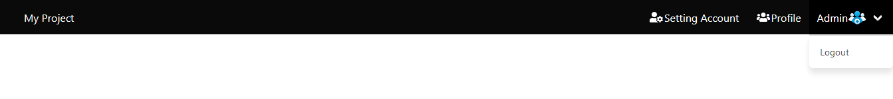
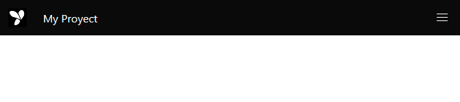
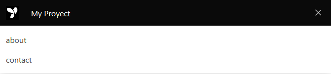

# Navbar and nav widget

[The navbar component](https://bulma.io/documentation/components/navbar/) is a responsive and versatile horizontal
navigation bar.

<p align="center">
    
</p>

<p align="center">
    
</p>

<p align="center">
    
</p>

HTML generated consists of:

- `navbar` the main container.
- `navbar-brand` the left side, always visible, which usually contains the logo and optionally some links or icons.
- `navbar-burger` the hamburger icon, which toggles the navbar menu on touch devices.
- `navbar-menu` the right side, hidden on touch devices, visible on a desktop.
- `navbar-start` the left part of the menu, which appears next to the navbar brand on desktop.
- `navbar-end` the right part of the menu, which appears at the end of the navbar.
- `navbar-item` each single item of the navbar, which can either be an a or a div.

## Usage

You can use Navbar the following way:

```php
<?php

declare(strict_types=1);

use Yiisoft\Yii\Bulma\Nav;
use Yiisoft\Yii\Bulma\NavBar;
use Yiisoft\Yii\Bulma\Asset\BulmaAsset;
use Yiisoft\Yii\Bulma\Asset\BulmaJsAsset;

/**
 * @var Yiisoft\Assets\AssetManager $assetManager
 * @var Yiisoft\View\WebView $this
 */

/* Register assets in view */

$assetManager->register([
    BulmaAsset::class,
    BulmaJsAsset::class
]);

$this->setCssFiles($assetManager->getCssFiles());
$this->setJsFiles($assetManager->getJsFiles());
?>

// The Font-Awesome Asset must be added, in this case we are going to use an external library.
<script defer src="https://use.fontawesome.com/releases/v5.3.1/js/all.js"></script>

<?= NavBar::widget()
    ->brandLabel('My Project')
    ->brandImage('yii-logo.jpg')
    ->brandUrl('/')
    ->options(['class' => 'is-black', 'data-sticky' => '', 'data-sticky-shadow' => ''])
    ->itemsOptions(['class' => 'navbar-end'])
    ->begin()
?>

<?= Nav::widget()
    ->items([
        [
            'label' => 'Setting Account',
            'url' => '/setting/account',
            'icon' => 'fas fa-user-cog',
            'iconOptions' => ['class' => 'icon']
        ],
        [
            'label' => 'Profile',
            'url' => '/profile',
            'icon' => 'fas fa-users',
            'iconOptions' => ['class' => 'icon']
        ],
        [
            'label' => 'Admin' . Html::img(
                '../../docs/images/icon-avatar.png',
                ['class' => 'img-rounded', 'aria-expanded' => 'false']
            ),
            'items' => [
                ['label' => 'Logout', 'url' => '/auth/logout'],
            ],
            'encode' => false
        ]
    ])
    ->render()
?>

<?= NavBar::end() ?>
```

HTML produced is like the following:

```html
<nav id="w1-navbar" class="navbar is-black" data-sticky="" data-sticky-shadow="">
    <div class="navbar-brand">
        <span class="navbar-item">
            
        </span>
        <a class="navbar-item" href="/">My Project</a>
        <a class="navbar-burger" aria-expanded="false" aria-label="menu" role="button">
            <span aria-hidden="true"></span><span aria-hidden="true"></span><span aria-hidden="true"></span>
        </a>
    </div>
    <div id="w1-navbar-Menu" class="navbar-menu">
        <div class="navbar-end"><a class="navbar-item" href="/setting/account"><span class="icon"><i class="fas fa-user-cog"></i></span><span>Setting Account</span></a>
            <a class="navbar-item" href="/profile"><span class="icon"><i class="fas fa-users"></i></span><span>Profile</span></a>
            <div class="navbar-item has-dropdown">
                <a class="navbar-link" href="#">Admin</a>
                <div id="w2-dropdown" class="navbar-dropdown is-hoverable">
                    <a class="navbar-item" href="/auth/logout">Logout</a>
                </div>
            </div>
        </div>
    </div>
</nav>
```

## Reference


Method | Description | Default
-------|-------------|---------
`brand(string $value)` | Custom brand HTML. Overrides `brandLabel` and `brandImage`. | ''
`brandLabel(string $value)` | Text of the brand label. | ''
`brandImage(string $value)` | Image of the brand. | ''
`brandUrl(string $value)` | "href" of the brand's link. | `/`
`toggleIcon(string $value)` | Toggle icon. | `<span aria-hidden='true'></span>`
`options(array $value)` | HTML attributes for the nav tag. | [`class` => `navbar`]
`optionsBrand(array $value)` | HTML attributes of the brand tag. | [`class` => `navbar-brand`]
`optionsBrandLabel` | HTML attributes of the brand label tag. | [`class` => `navbar-item`]
`optionsBrandImage` | HTML attributes of the brand link tag.           | [`class` => `navbar-item`]
`optionsItems(array $value)` | HTML attributes of the nav items tag. | [`class` => `navbar-start`] or [`class` => `navbar-end`]
`optionsMenu(array $value)` | HTML attributes of the nav menu tag. | [`class` => `navbar-menu`]
`optionsToggle(array $value)`| HTML attributes of the navbar toggle button tag. | [`aria-expanded` => `false`, `aria-label` => `menu`, `class` => `navbar-burger`, `role` => `button`]
`withEncodeTags()` | Allows you to enable the encoding tags html. | `true`
