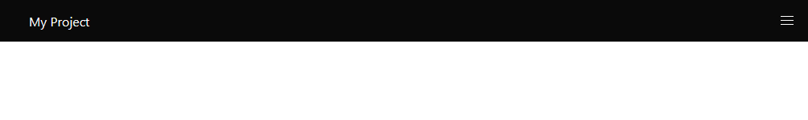
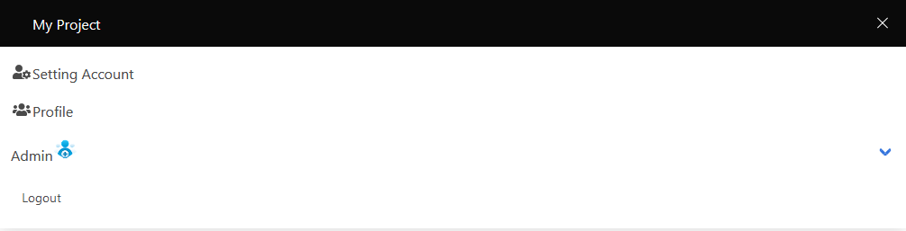

## Navbar and nav widget

The navbar widget is a responsive and versatile horizontal navigation bar.

<p align="center">
    
</p>

<p align="center">
    
</p>

<p align="center">
    
</p>

HTML generated consists of:

- `navbar` the main container.
- `navbar-brand` the left side, always visible, which usually contains the logo and optionally some links or icons.
- `navbar-burger` the hamburger icon, which toggles the navbar menu on touch devices.
- `navbar-menu` the right side, hidden on touch devices, visible on a desktop.
- `navbar-start` the left part of the menu, which appears next to the navbar brand on desktop.
- `navbar-end` the right part of the menu, which appears at the end of the navbar.
- `navbar-item` each single item of the navbar, which can either be an a or a div.

## Usage

You can use Navbar the following way:

```php
<?php

declare(strict_types=1);

use Yiisoft\Yii\Bulma\Nav;
use Yiisoft\Yii\Bulma\NavBar;
use Yiisoft\Yii\Bulma\Asset\BulmaAsset;
use Yiisoft\Yii\Bulma\Asset\BulmaJsAsset;

/**
 * @var Yiisoft\Assets\AssetManager $assetManager
 * @var Yiisoft\View\WebView $this
 */

/* Register assets in view */

$assetManager->register([
    BulmaAsset::class,
    BulmaJsAsset::class,
]);

$this->setCssFiles($assetManager->getCssFiles());
$this->setJsFiles($assetManager->getJsFiles());
?>

<?= NavBar::begin()
    ->brandLabel('My Project')
    ->brandImage('yii-logo.jpg')
    ->brandUrl('/')
    ->options(['class' => 'is-black', 'data-sticky' => '', 'data-sticky-shadow' => ''])
    ->start() ?>

    <?= Nav::widget()
        ->items([
            ['label' => 'about', 'url' => '/about'],
            ['label' => 'contact', 'url' => '/contact'],
        ]) ?>

<?= NavBar::end() ?>
```

HTML produced is like the following:

```html
<nav id="w1-navbar" class="navbar is-black" data-sticky="" data-sticky-shadow="">
    <div class="navbar-brand">
        <span class="navbar-item">
            
        </span>
        <a class="navbar-item" href="/">My Project</a>
        <a class="navbar-burger" aria-expanded="false" aria-label="menu" role="button">
            <span aria-hidden="true"></span><span aria-hidden="true"></span><span aria-hidden="true"></span>
        </a>
    </div>
    <div id="w1-navbar-Menu" class="navbar-menu">
        <div class="navbar-start"></div>
    </div>
</nav>
```

## Reference


Method                       | Description | Default |
-----------------------------|-------------|---------|
`brandLabel(string $value)`  | The text of the brand label| ''
`brandImage(string $value)`  | The image of the brand. | ''
`brandUrl(string $value)`    | The URL for the brand's hyperlink tag used for the "href". | `/`
`options`                    | HTML attributes for the tag nav. | [`class` => `navbar`]
`optionsBrand(array $value)` | HTML attributes of the brand. | [`class` => `navbar-brand`]
`optionsBrandLabel`          | HTML attributes of the brand label. | [`class` => `navbar-item`]
`optionsBrandImage`          | HTML attributes of the brand link. | [`class` => `navbar-item`]
`optionsItems(array $value)` | HTML attributes of the nav items. | [`class` => `navbar-start`] or [`class` => `navbar-end`]
`optionsMenu(array $value)`  | HTML attributes of the nav menu. | [`class` => `navbar-menu`]
`optionsToggle(array $value)`| HTML attributes of the navbar toggle button. | [`aria-expanded` => `false`, `aria-label` => `menu`, `class` => `navbar-burger`, `role` => `button`]
