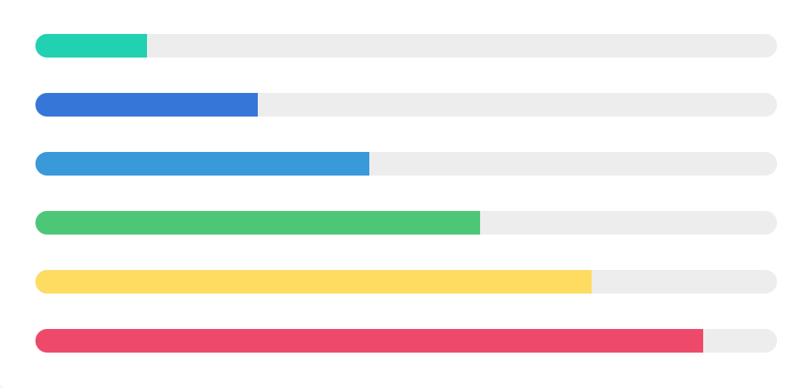
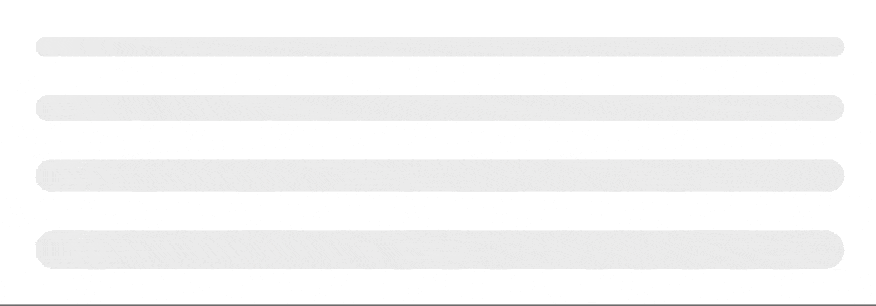

# Progress Bar widget

[The Bulma progress bar](https://bulma.io/documentation/elements/progress/) is a simple CSS class that styles the native
`<progress>` [HTML element](https://developer.mozilla.org/en-US/docs/Web/HTML/Element/progress).

Loading widget looks like the following:

<p align="center">
    
</p>

In progress widget looks like this:

<p align="center">
    
</p>

## Usage

```php
<?php

declare(strict_types=1);

use Yiisoft\Yii\Bulma\ProgressBar;
use Yiisoft\Yii\Bulma\Asset\BulmaAsset;

/** Register assets in view */

$assetManager->register(BulmaAsset::class);

$this->setCssFiles($assetManager->getCssFiles());

echo ProgressBar::widget()
    ->size('is-medium')
    ->color('is-info')
    ->maxValue(100)
    ->value(75);
```

The code above generates the following HTML:

```html
<progress id="w1-progressbar" class="progress is-medium is-info" value="75" max="100">75%</progress>
```

## Reference

Method | Description | Default
-------|-------------|---------
`id(string $value)` | Widget ID. | `''`
`autoIdPrefix(string $value)` | Prefix to the automatically generated widget ID. | `w`
`value(float $value)` | The progress value. Set to `0` to display a loading animation. | `0`
`maxValue(int $value)` | Maximum progress value. `0` means no maximum. | `100`
`options(array $value)` | HTML attributes for the widget container tag. | `['class' => 'progress']`
`size(string $value)` | Bar size. | `is-small`, `is-medium`, `is-large`
`color(string $value)` | Bar color. | `is-primary`, `is-link`, `is-info`, `is-success`, `is-warning`, `is-danger`
