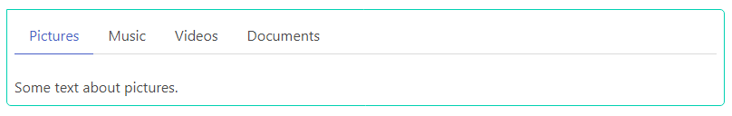

# Tabs widget

### Responsive horizontal [navigation tabs](https://bulma.io/documentation/components/tabs/), with different styles.

<p align="center">
    </br>
    
</p>

## Usage

```php
<?php

declare(strict_types=1);

use Yiisoft\Yii\Bulma\Tabs;
use Yiisoft\Yii\Bulma\Asset\BulmaAsset;
use Yiisoft\Yii\Bulma\Asset\BulmaJsAsset;

/**
 * @var \Yiisoft\Assets\AssetManager $assetManager
 * @var \Yiisoft\View\WebView $this
 */

$assetManager->registerMany([
    BulmaAsset::class,
    BulmaJsAsset::class,
]);

$this->setCssFiles($assetManager->getCssFiles());
$this->setJsFiles($assetManager->getJsFiles());

echo Tabs::widget()
    ->alignment(Tabs::ALIGNMENT_CENTERED)
    ->size(Tabs::SIZE_LARGE)
    ->style(Tabs::STYLE_BOX)
    ->items([
        [
            'label' => 'Pictures',
            'icon' => 'fas fa-image',
            'active' => true,
            'content' => 'Some text about pictures',
            'contentOptions' => [
                'class' => 'is-active',
            ],
        ],
        ['label' => 'Music', 'icon' => 'fas fa-music', 'content' => 'Some text about music'],
        ['label' => 'Videos', 'icon' => 'fas fa-film', 'content' => 'Some text about videos'],
        ['label' => 'Documents', 'icon' => 'far fa-file-alt', 'content' => 'Some text about documents'],
    ]);
```

HTML produced is like the following:

```html
<div class="tabs is-centered is-large is-boxed">
    <ul>
        <li class="is-active">
            <a href="#w0-tabs-c1">
                <span class="icon is-small"
                    ><i class="fas fa-image" aria-hidden="true"></i
                ></span>
                <span>Pictures</span>
            </a>
        </li>
        <li>
            <a href="#w0-tabs-c2">
                <span class="icon is-small"
                    ><i class="fas fa-music" aria-hidden="true"></i
                ></span>
                <span>Music</span>
            </a>
        </li>
        <li>
            <a href="#w0-tabs-c3">
                <span class="icon is-small"
                    ><i class="fas fa-film" aria-hidden="true"></i
                ></span>
                <span>Videos</span>
            </a>
        </li>
        <li>
            <a href="#w0-tabs-c4">
                <span class="icon is-small"
                    ><i class="far fa-file-alt" aria-hidden="true"></i
                ></span>
                <span>Documents</span>
            </a>
        </li>
    </ul>
</div>

<div class="tabs-content">
    <div id="w0-tabs-c1" class="is-active">Some text about pictures</div>
    <div id="w0-tabs-c2">Some text about music</div>
    <div id="w0-tabs-c3">Some text about videos</div>
    <div id="w0-tabs-c4">Some text about documents</div>
</div>
```

## Reference

Method | Description | Default
-------|-------------|---------
`alignment(string $value)` | Alignment of the tabs list. | `''`
`autoIdPrefix(string $value)` | Prefix to the automatically generated widget ID. | `w`
`currentPath(string $value)` | Allows you to assign the current path of the URL from request controller. | ``
`deactivateItems()` | Disable active items according to their current path. | `false`
`id(string $value)` | Widget ID. | `''`
`items(array $value)` | List of tab items. | `[]`
`options(array $value)` | HTML attributes for the widget container tag. | [`class` => `tabs`]
`size(string $value)` | Size of the tabs list. | `is-small`, `is-medium`, `is-large`
`style(string $value)` | Style of the tabs list. | `''`
`tabsContentOptions(array $value)` | List of HTML attributes for the `tabs-content` container. | `[]`
`withoutEncodeLabels()` | When tags Labels HTML should not be encoded. | `false`       |
